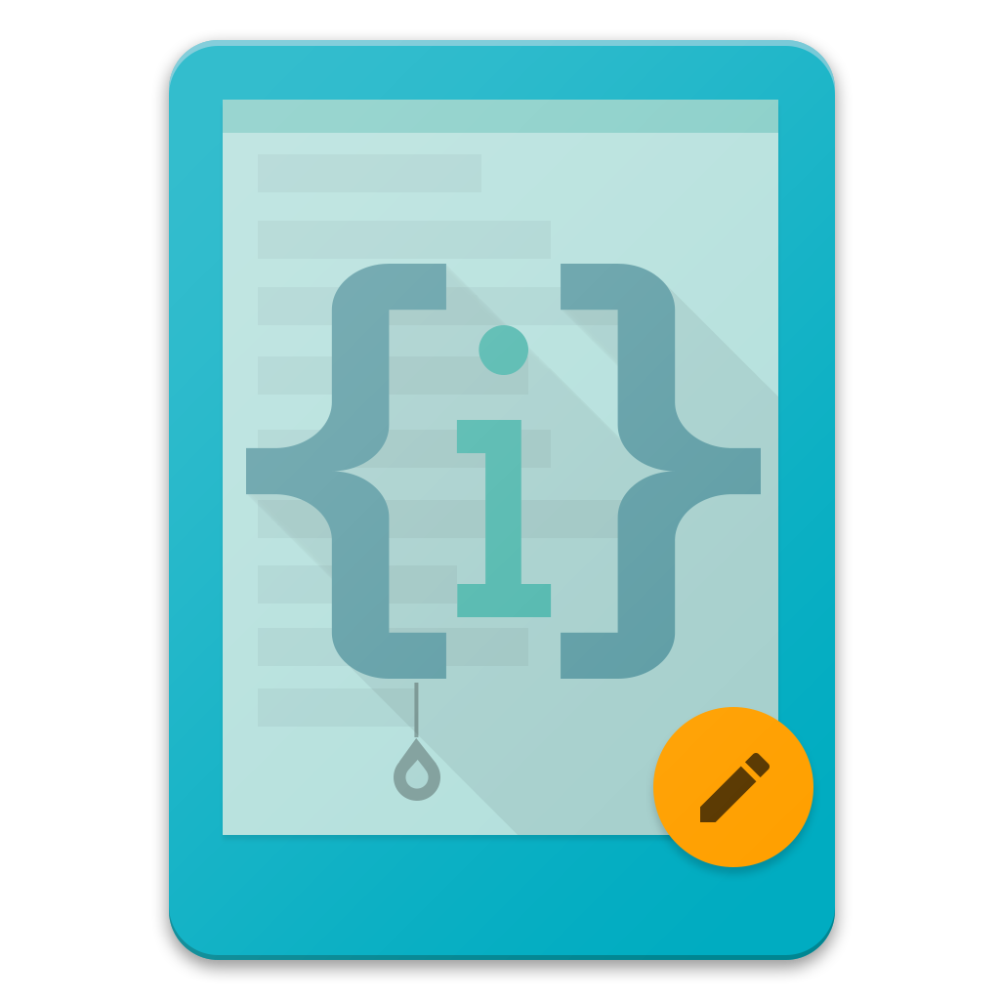

# Kodis
> Kodis is a basic Android Code and Text Editor  

### Features
- Basic file management like file and folder creation
- File picker
- Automatic Project View of tree style hierarchy
- Syntax Highlighting
- Open various files via tabs
- Use common programming symbols
- Intelligent state management between app closures

### Screenshots

### Authors
Areeb Jamal [@iamareebjamal](https://github.com/iamareebjamal)  
Divya Prakash Varshney [@divs4debu](https://github.com/divs4debu)
